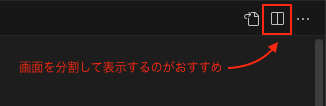

## 簡単な説明

当リポジトリは初心者がサイトを初めて構築することを考えて制作したプロジェクトになります。

HTML,CSS のみを使用して簡単に Web サイトを構築することができます。

基本的な記述の仕方から、応用的な部分をカバーできる内容となっております。

## ダウンロードの仕方

1. 下記の画像を参考にプロジェクトをダウンロードしてください。

2. ダウンロードしたファイルを解凍して、プロジェクトを vscode で開いてください。

## 使い方

- `index.html` と `assets/css/style.css` に記述して練習することができます。
- ソースコードは`code`の中にあるそれぞれのスクリーンショットを見ながら記述することをおすすめします。
- `*/ -- /*`などで書かれているコメントは練習時記述しなくて結構です。
- `sample`は完成実際に完成したものです。[こちらからも閲覧できます](https://lesson-site-01.vercel.app/)

## おすすめ

- 画面を分割して片方にコード、もう片方にスクリーンショットを表示しながら作業をしてみましょう

- 拡張機能 Live Server を使ってみましょう

  ダウンロード済みなら vscode 右下にある Go Live を押して拡張機能を起動させましょう。

- 拡張機能 Prettier を使いましょう。
